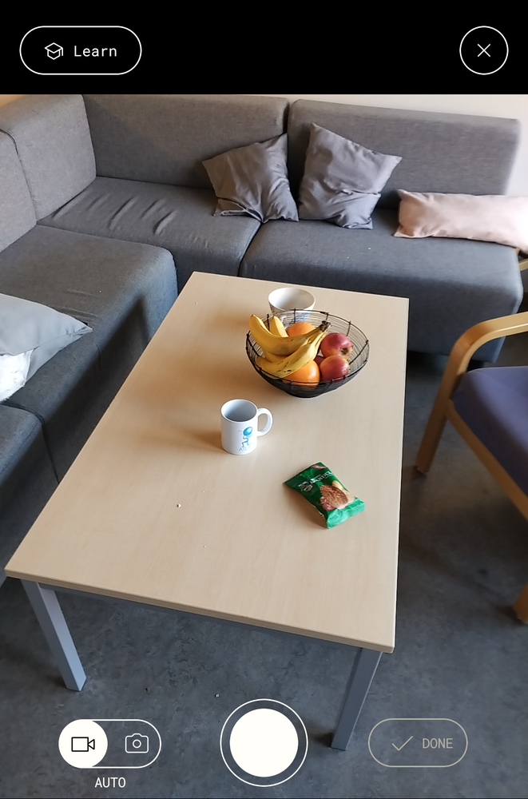
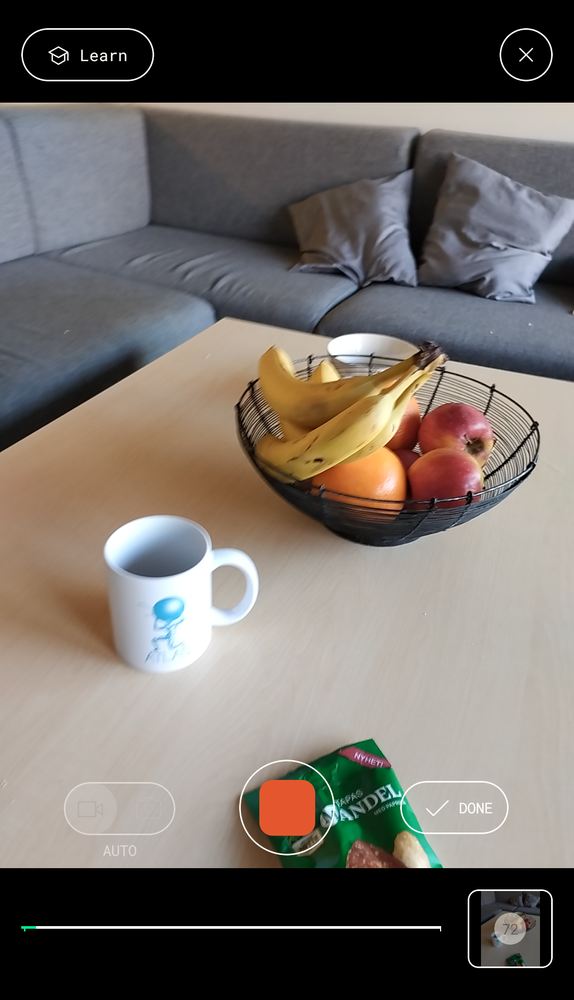
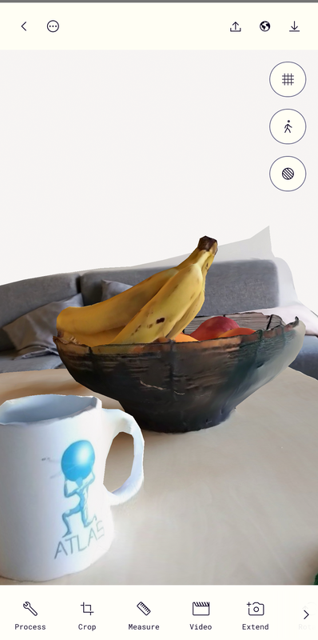

# Hvordan bruke polycam
Polycam er en app som lager 3d modeller av bilder du tar med mobilen. Den er desverre ikke fri programvare, men det finnes mer tekniske, frie programmer som kan gjøre det samme på pc.  
Polycam kan lastes ned til [android](https://play.google.com/store/apps/details?id=ai.polycam) og [iphone](https://apps.apple.com/no/app/polycam-3d-scanner-lidar-360/id1532482376)

Første gang du åpner appen blir du spurt om å lage en bruker. etter du har registrert deg får du opp denne skjermen:  

{ width=250px }

Nå er det bare å trykke på den hvit knappen så tar den automatisk bilder når du beveger deg rundt motivet.  
Når du er ferdig trykker du på knappen som heter "Done": 
 
{ width=250px }

Da år du opp en skjerm som ser slik ut: 
 
{ width=250px }

"Detail" styrer hvor stor fila blir, medium er som regel nok. "Object Masking" prøver å klippe vekk bakgrunn fra modellen så du kun sitter igjen med motivet. I første omgang er et lurt å skru den av.

Trykk "Upload & process" og vent på at den gjør seg ferdig.

Når modellen er klar kan trykke inn og se hvordan den ble

{ width=250px }