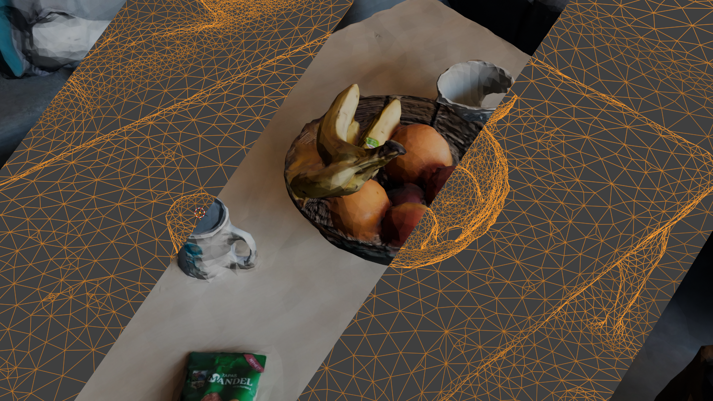

# 3d scanning med mobilen

Dere skal bruke appen Polycam til å lage en 3d modell av noe dere velger selv. Det er lurt å scanne noe som også ble scanna med Faro'n så dere kan sammenligne resultatet!

1. Scan noe med Polycam og eksporter 3d fila til pcen. [Se bruksanvisning](../bruksanvisninger/polycam.html)
2. Åpne den i blender og sammenlign resultatet med det fra Faro'n