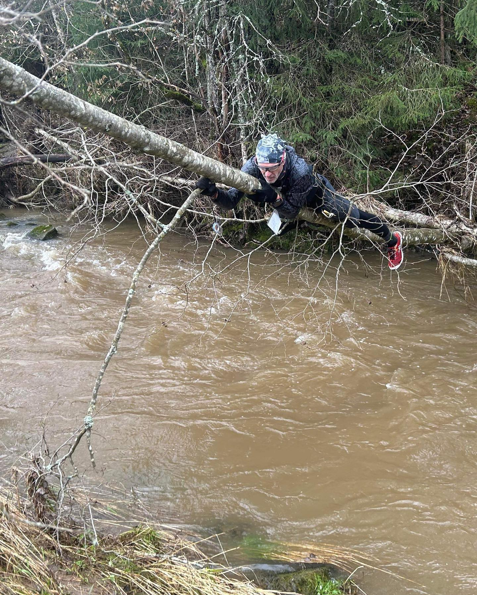

(orienteringslop)=
# Orienteringsløp korteste vei

**Mål:** Målet med denne oppgaven er å anvende geomatikk-kunnskaper i praksis gjennom et orienteringsløp. 

**Oppgavebeskrivelse:** 

Dere vil bli delt inn i grupper og hver gruppe vil få utdelt en GNSS-mottaker. Orienteringsløpet består av flere poster som er plassert rundt på campus. Hver post har en unik kode som skal registreres i GNSS-mottakeren når dere ankommer posten.

Målet med løpet er å finne den korteste veien mellom postene. Det er ikke nødvendig å besøke postene i en bestemt rekkefølge, men alle postene må besøkes. Gruppen som gjennomfører løpet ved å gå den korteste totalveien, vinner. 

GNSS-mottakeren vil lagre sporinformasjonen (lengden på veien dere har gått) og dette vil bli brukt til å bestemme vinneren. Husk at det er totalveien som teller, ikke tiden det tar å fullføre løpet.

**Vurdering:** 

Vurderingen vil være basert på nøyaktigheten av sporet som er lagret i GNSS-mottakeren. Gruppen som har det korteste sporet (dvs. den korteste totalveien mellom alle postene) vil bli erklært som vinner.

Lykke til! Må det beste laget vinne!

